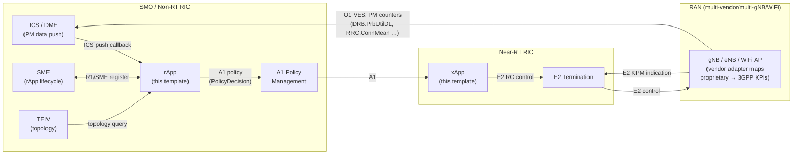
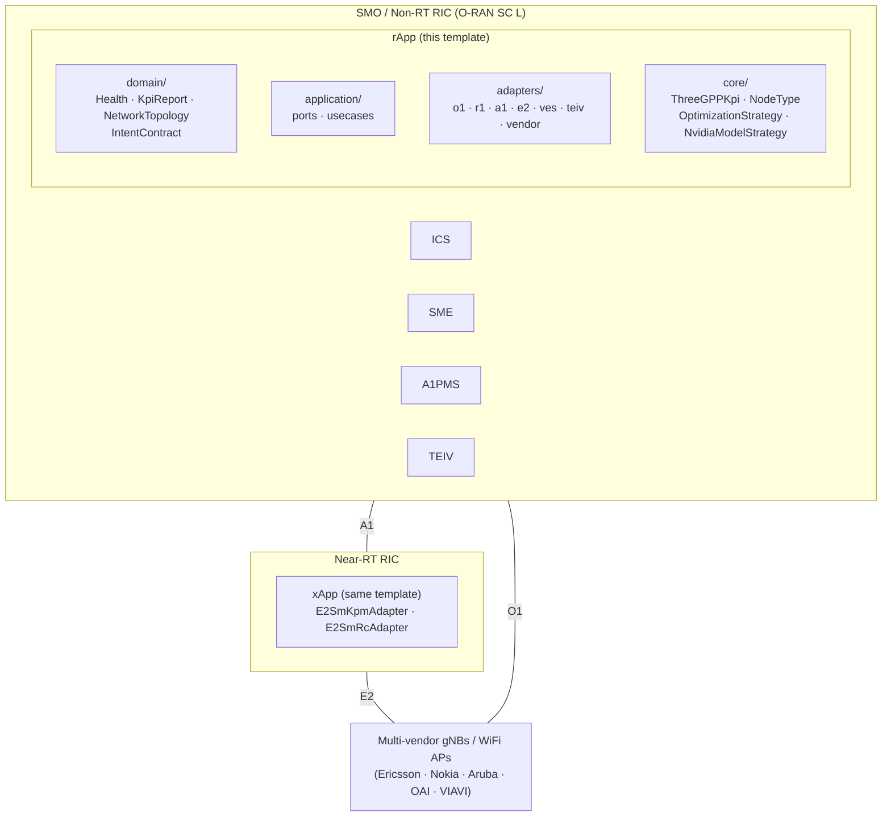
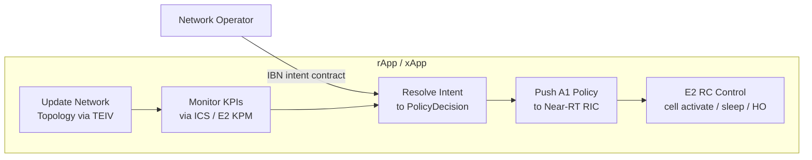
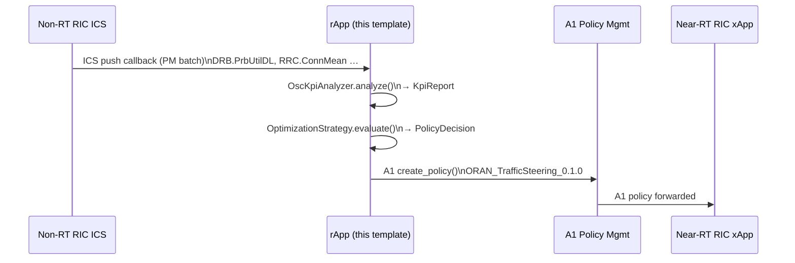
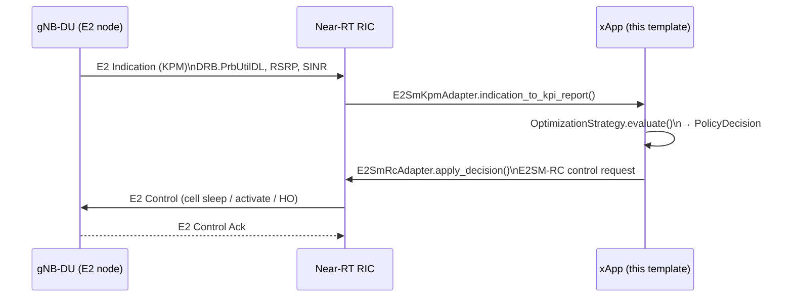
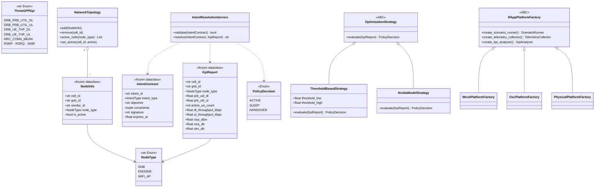

# CONTEXT.md — Project Documentation (PRD)

> **Purpose:** Design reference for Claude Code sessions and paper writing.
> Follows [BMW Lab SOP project-documentation.md](https://github.com/bmw-ece-ntust/SOP/blob/master/project-documentation.md).
> Keep concise — this file is read every LLM session.
> Do **not** log session activity here; use `MEMORY.md`.

---

## Introduction

**Repo:** `template` — BMW Lab (NTUST ECE) rApp / xApp starter template
**Branch:** `rapp` | **Platform:** O-RAN Non-RT RIC (rApp) + Near-RT RIC (xApp)
**Language:** Python 3.12 | **Runtime deps:** `requests>=2.32` only

**Background:** O-RAN disaggregates RAN management into standardized open
interfaces (O1/A1/E2/R1).  Research rApps and xApps targeting these interfaces
require boilerplate that is simultaneously O-RAN compliant, multi-vendor capable,
and extensible toward Intent-Based Networking (IBN).  Existing OSC reference
apps use flat architecture with no design patterns; they are not reproducible
across projects.

**Contribution:** A hexagonal / Ports-and-Adapters template that:
1. Implements O1/A1/R1/E2 adapter stubs with typed port contracts.
2. Provides a `ThreeGPPKpi` enum so all 3GPP parameter references are
   spec-traceable (TS 28.552, TS 36.214).
3. Supports multi-vendor / multi-gNB / WiFi AP via `NodeType` enum +
   `NetworkTopology` registry + `VendorParameterMap`.
4. Stubs contract-based IBN (`IntentContract` + HMAC validation) for future
   NVIDIA NeMo / NIM integration.
5. Requires zero code changes to move from mock testing → simulation (via BMW Lab
   TA rApp) → production OSC deployment — only `RAPP_PLATFORM` env var changes.

**Knowledge graph:** `graphify-out/GRAPH_REPORT.md` (generated by `/graphify .`)
is a navigable architecture/dependency index of this codebase — consult it
before reading raw source files.

---

## Execution Status

| Step | Status | Timeline | Notes |
| --- | --- | --- | --- |
| Hexagonal architecture + HTTP health endpoints | ✅ | 2025-05-30 | |
| O1/R1/A1 adapter stubs + OscPlatformFactory | ✅ | 2026-06-03 | |
| ThreeGPPKpi enum + expanded KpiReport | ✅ | 2026-06-03 | |
| NodeType + NetworkTopology + TEIV adapter | ✅ | 2026-06-03 | |
| IntentContract + IntentResolutionService stub | ✅ | 2026-06-03 | |
| E2 adapter stubs (SM-KPM + SM-RC) | ✅ | 2026-06-03 | stubs; no RMR/gRPC impl |
| VES event adapter stub | ✅ | 2026-06-03 | |
| MockPlatformFactory + RAPP_PLATFORM routing | ✅ | 2026-06-03 | |
| test/ removed; Helm chart → helm/template-app/ | ✅ | 2026-06-03 | Simulation via BMW Lab TA rApp |
| docs/simulation.md — TA rApp testing guide | ✅ | 2026-06-03 | |
| graphify knowledge-graph skill integrated | ✅ | 2026-06-11 | `.graphifyignore` added; `graphify-out/` not yet generated |
| E2Client RMR/gRPC implementation | ⏳ | TBD | Requires OSC xapp-frame-py |
| VES push-receiver HTTP endpoint | ⏳ | TBD | Wire to FastAPI route |
| IntentResolutionService.resolve() | ⏳ | TBD | Implement per use-case |
| NvidiaModelStrategy NIM adapter | ⏳ | TBD | Requires NVIDIA NIM account |

---

## Minimum Requirements

| Component | Requirement |
| --- | --- |
| Python | 3.12 |
| Docker | 24.x |
| Kubernetes | 1.28+ |
| requests | ≥ 2.32 |
| Non-RT RIC (osc mode) | O-RAN SC L Release or BMW Lab TA rApp |

---

## System Model

---

## System Architecture

### Layer responsibilities

| Layer | Package | Rule |
| --- | --- | --- |
| Domain | `src/rapp/domain/` | Pure logic; no I/O; no frameworks |
| Application | `src/rapp/application/` | Use-cases; depends only on domain + ports |
| Adapters | `src/rapp/adapters/` | O-RAN interface adapters + vendor normalization |
| Config | `src/rapp/config/` | Settings from env vars only |
| Infrastructure | `src/rapp/infrastructure/` | Logging |
| Core | `src/core/` | 3GPP models, enums, strategy ABCs |
| Factories | `src/factories/` | Platform-specific component creators |

### O-RAN Interface Compliance

| Interface | Spec | Adapter | Status |
| --- | --- | --- | --- |
| O1 (YANG/NETCONF) | O-RAN.WG5.O1, TS 28.535 | `adapters/o1/` | Stub (SDNC REST) |
| R1/SME | O-RAN WG2 R1-AP | `adapters/r1/SMEAdapter` | Implemented |
| R1/ICS | O-RAN WG2 R1-AP | `adapters/r1/ICSAdapter` | Implemented |
| A1 | O-RAN.WG2.A1AP | `adapters/a1/` | Implemented |
| E2 SM-KPM | O-RAN.WG3.E2SM-KPM | `adapters/e2/E2SmKpmAdapter` | Stub |
| E2 SM-RC | O-RAN.WG3.E2SM-RC | `adapters/e2/E2SmRcAdapter` | Stub |
| VES (O1 events) | TS 28.532 | `adapters/ves/` | Stub |

---

## Use Case Diagram

---

## Message Sequence Chart

### UC: rApp KPI monitoring → A1 policy push

### UC: xApp E2 KPM → E2 RC control

---

## Flowchart

### Main rApp control loop

---

## Class Diagram

---

## System Parameters

| Category | Parameter | Type | Unit | Spec | Spec Section | Page/§ |
| --- | --- | --- | --- | --- | --- | --- |
| E2/ICS Input | [`DRB.PrbUtilDL`](https://www.3gpp.org/ftp/Specs/archive/28_series/28.552/28552-i50.zip) | float | ratio | TS 28.552 | §5.1.1.12.1 | Table 5.1.1.12.1-1, p.47 |
| E2/ICS Input | [`DRB.PrbUtilUL`](https://www.3gpp.org/ftp/Specs/archive/28_series/28.552/28552-i50.zip) | float | ratio | TS 28.552 | §5.1.1.12.2 | Table 5.1.1.12.2-1, p.48 |
| E2/ICS Input | [`DRB.UEThpDL`](https://www.3gpp.org/ftp/Specs/archive/28_series/28.552/28552-i50.zip) | float | kbps | TS 28.552 | §5.1.1.10.1 | Table 5.1.1.10.1-1, p.44 |
| E2/ICS Input | [`DRB.UEThpUL`](https://www.3gpp.org/ftp/Specs/archive/28_series/28.552/28552-i50.zip) | float | kbps | TS 28.552 | §5.1.1.10.2 | Table 5.1.1.10.2-1, p.45 |
| E2/ICS Input | [`RRC.ConnMean`](https://www.3gpp.org/ftp/Specs/archive/28_series/28.552/28552-i50.zip) | int | count | TS 28.552 | §5.1.1.1.1 | Table 5.1.1.1.1-1, p.21 |
| Radio Meas. | [`RSRP`](https://www.3gpp.org/ftp/Specs/archive/36_series/36.214/36214-i40.zip) | float | dBm | TS 36.214 | §5.1.1 | §5.1.1, p.9 |
| Radio Meas. | [`RSRQ`](https://www.3gpp.org/ftp/Specs/archive/36_series/36.214/36214-i40.zip) | float | dB | TS 36.214 | §5.1.2 | §5.1.2, p.10 |
| Radio Meas. | [`SINR`](https://www.3gpp.org/ftp/Specs/archive/36_series/36.214/36214-i40.zip) | float | dB | TS 36.214 | §5.1.4 | §5.1.4, p.12 |
| A1 Output | `PolicyDecision` | Enum | — | O-RAN.WG2.A1AP | §8.2 | §8.2, p.31 |
| O1 VES Event | [`cellStatusChange`](https://www.3gpp.org/ftp/Specs/archive/28_series/28.532/28532-i50.zip) | Event | — | TS 28.532 | §5.2.6.2 | §5.2.6.2, p.28 |

---

## Key Symbols Quick Reference

| Symbol | File | Notes |
| --- | --- | --- |
| `main()` | `src/main.py` | Composition root; `RAPP_PLATFORM` factory routing |
| `Settings` | `src/rapp/config/settings.py` | Frozen dataclass; all `RAPP_*` env vars |
| `KpiReport` | `src/core/models/__init__.py` | Frozen dataclass; 10 3GPP-linked fields |
| `ThreeGPPKpi` | `src/core/models/parameters.py` | String enum; canonical 3GPP counter names |
| `NodeType` | `src/core/models/parameters.py` | `GNB` / `ENODEB` / `WIFI_AP` |
| `VendorParameterMap` | `src/core/models/parameters.py` | Vendor key → ThreeGPPKpi translation |
| `PolicyDecision` | `src/core/models/__init__.py` | `ACTIVE` / `SLEEP` / `HANDOVER` |
| `NetworkTopology` | `src/rapp/domain/topology.py` | Multi-gNB cell registry |
| `NodeInfo` | `src/rapp/domain/topology.py` | Per-cell metadata incl. vendor_id |
| `IntentContract` | `src/rapp/domain/intent.py` | Signed IBN contract; HMAC validation |
| `IntentResolutionService` | `src/rapp/domain/intent.py` | Whitelist + expiry + signature checks |
| `IntentType` | `src/rapp/domain/intent.py` | Whitelist enum for contract-based IBN |
| `OptimizationStrategy` | `src/core/strategies/__init__.py` | ABC: `evaluate(KpiReport) → PolicyDecision` |
| `NvidiaModelStrategy` | `src/core/strategies/__init__.py` | NVIDIA NIM stub; pass `nim_infer` callable |
| `GnbTelemetryAdapter` | `src/rapp/adapters/vendor/__init__.py` | Vendor metrics → `KpiReport` |
| `O1SdncAdapter` | `src/rapp/adapters/o1/__init__.py` | O-RAN YANG → SDNC REST |
| `SMEAdapter` | `src/rapp/adapters/r1/__init__.py` | rApp lifecycle with Non-RT RIC |
| `ICSAdapter` | `src/rapp/adapters/r1/__init__.py` | Data subscription |
| `A1Adapter` | `src/rapp/adapters/a1/__init__.py` | `PolicyDecision` → A1 policy JSON |
| `E2SmKpmAdapter` | `src/rapp/adapters/e2/__init__.py` | E2SM-KPM subscribe + parse |
| `E2SmRcAdapter` | `src/rapp/adapters/e2/__init__.py` | E2SM-RC control request |
| `VesEventAdapter` | `src/rapp/adapters/ves/__init__.py` | Inbound O1 VES event dispatch |
| `TEIVAdapter` | `src/rapp/adapters/teiv/__init__.py` | TEIV topology discovery |
| `RAppPlatformFactory` | `src/factories/__init__.py` | ABC: creates `ScenarioRunner/Collector/Analyzer` |
| `MockPlatformFactory` | `src/factories/mock/__init__.py` | In-memory; no deps |
| `OscPlatformFactory` | `src/factories/osc/__init__.py` | Real ICS + SME |

---

## Architectural Rules

1. **O-RAN protocols only.** The generic rApp / xApp never calls simulator APIs.
   Simulator lifecycle is the BMW Lab TA rApp's responsibility.
2. **No InfluxDB bypass.** Telemetry arrives via ICS subscription.  InfluxDB
   is an internal SMO concern.
3. **ThreeGPPKpi enum for all parameter references.**  No raw 3GPP string
   literals in business logic.
4. **Factory = deployment environment, not simulator vendor.**  `RAPP_PLATFORM`
   selects `mock` / `osc` / `physical`.  For simulation, use `osc` pointed at
   VIAVI RSG O-RAN interfaces or ns-O-RAN.
5. **IBN intent contracts must be validated** (whitelist + expiry + HMAC)
   before `IntentResolutionService.resolve()` is called.

---

## References

[1] 3GPP, TS 28.552 V18.5.0, 2024. https://www.3gpp.org/ftp/Specs/archive/28_series/28.552/

[2] 3GPP, TS 36.214 V18.0.0, 2024. https://www.3gpp.org/ftp/Specs/archive/36_series/36.214/

[3] 3GPP, TS 28.532 V18.5.0, 2024. https://www.3gpp.org/ftp/Specs/archive/28_series/28.532/

[4] O-RAN Alliance, O-RAN.WG2.A1AP-v06.00, 2024. https://specifications.o-ran.org/

[5] O-RAN Alliance, O-RAN.WG3.E2AP-v03.01, 2024. https://specifications.o-ran.org/

[6] O-RAN Alliance, O-RAN.WG3.E2SM-KPM-v03.00, 2024. https://specifications.o-ran.org/

[7] O-RAN Alliance, O-RAN.WG3.E2SM-RC-v01.03, 2024. https://specifications.o-ran.org/

[8] IETF RFC 9315, Intent-based Networking, 2022. https://www.rfc-editor.org/rfc/rfc9315

[9] O-RAN SC, nonrtric-rapp-healthcheck, 2024. https://gerrit.o-ran-sc.org/r/nonrtric/plt/rappmanager

[10] BMW Lab TA rApp, nonrtric-rapp-test-automation, 2024. https://github.com/bmw-ece-ntust/nonrtric-rapp-test-automation
