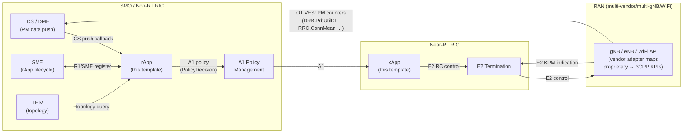
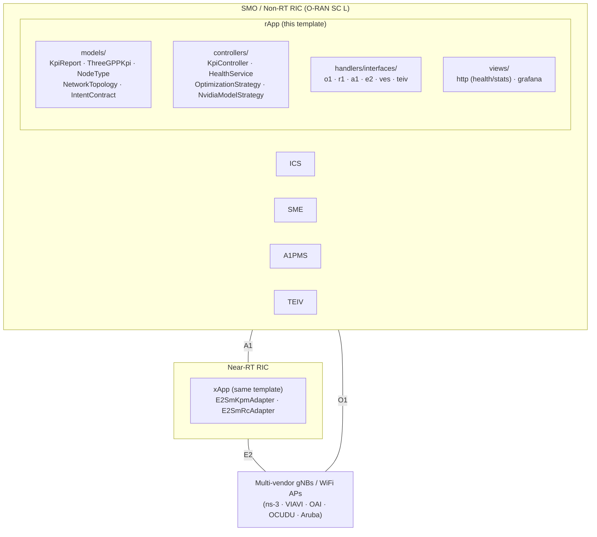
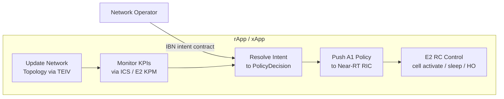
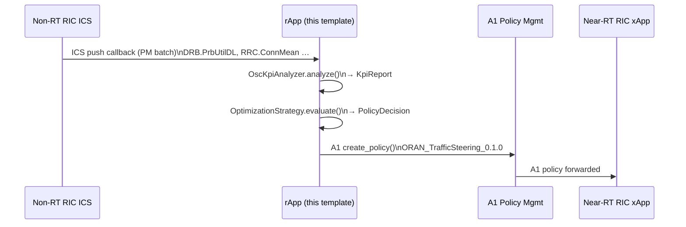
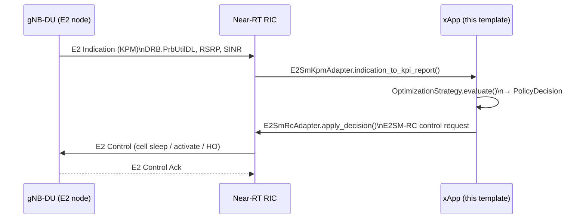
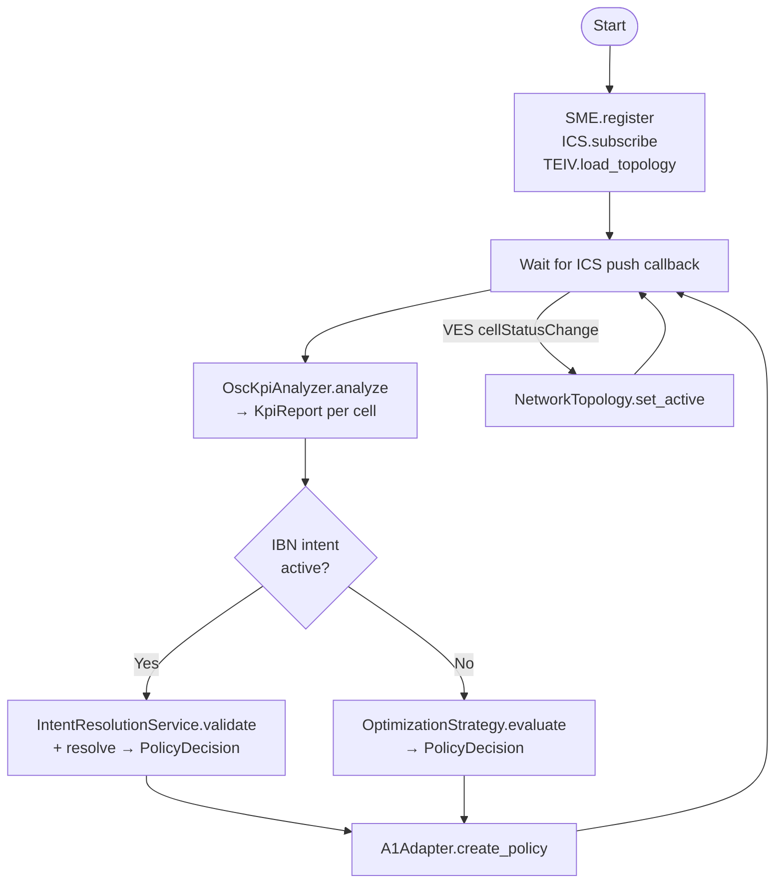
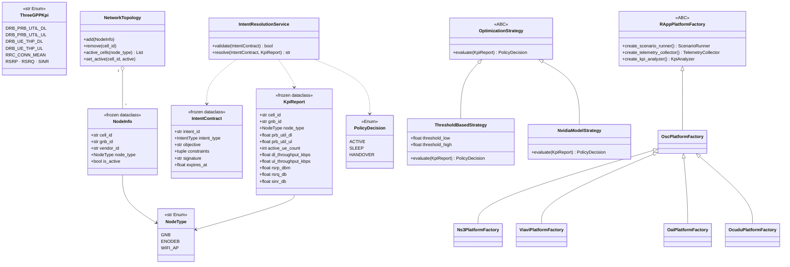
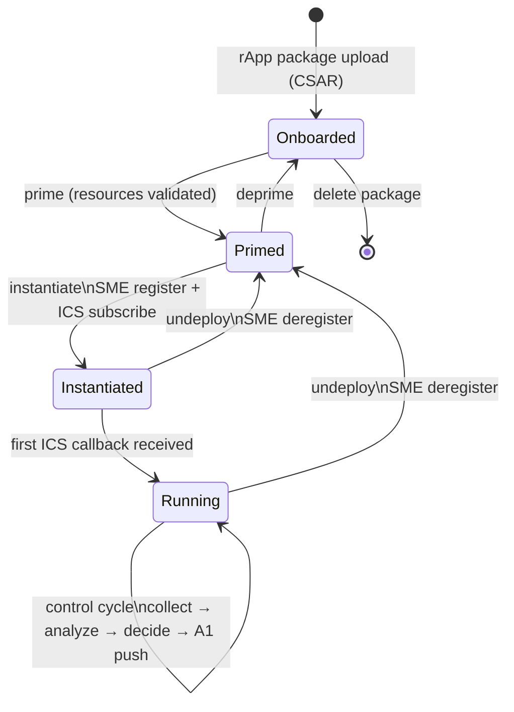
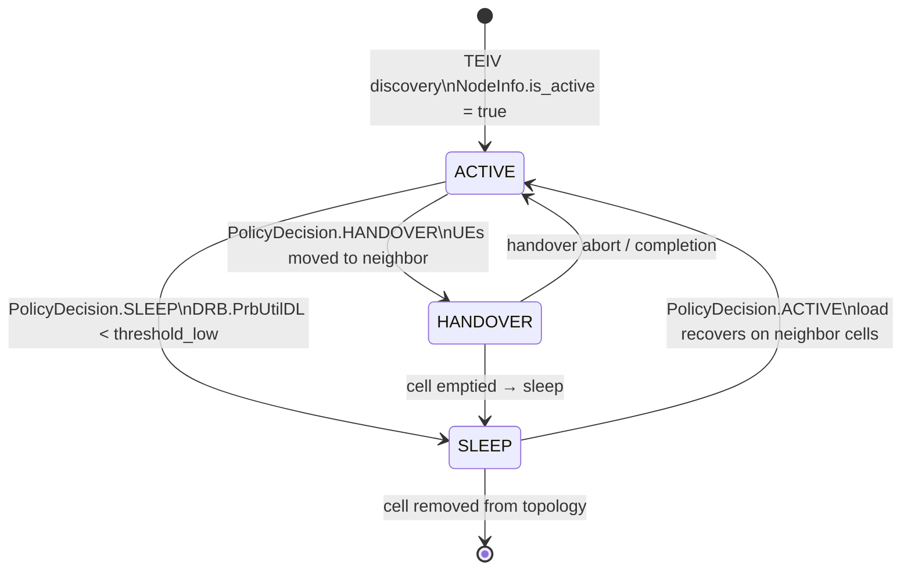

# CONTEXT.md — Project Documentation (PRD)

> **Purpose:** Design reference for Claude Code sessions and paper writing.
> Follows [BMW Lab SOP project-documentation.md](https://github.com/bmw-ece-ntust/SOP/blob/master/project-documentation.md).
> Keep concise — this file is read every LLM session.
> Do **not** log session activity here; use `MEMORY.md`.

---

## Introduction

**Repo:** `template` — BMW Lab (NTUST ECE) rApp / xApp starter template
**Branch:** `rapp` | **Platform:** O-RAN Non-RT RIC (rApp) + Near-RT RIC (xApp)
**Language:** Python 3.12 | **Runtime deps:** `requests>=2.32` only

**Background:** O-RAN disaggregates RAN management into standardized open
interfaces (O1/A1/E2/R1).  Research rApps and xApps targeting these interfaces
require boilerplate that is simultaneously O-RAN compliant, multi-vendor capable,
and extensible toward Intent-Based Networking (IBN).  Existing OSC reference
apps use flat architecture with no design patterns; they are not reproducible
across projects.

**Contribution:** A simple, professional **MVC + handlers** template (models /
controllers / views, with O-RAN I/O in handlers — the shape of OSC
`ric-app-kpimon-go`) that:
1. Implements O1/A1/R1/E2 interface adapters in `handlers/interfaces/`.
2. Provides a `ThreeGPPKpi` enum so all 3GPP parameter references are
   spec-traceable (TS 28.552, TS 36.214).
3. Supports multi-vendor / multi-gNB / WiFi AP via `NodeType` enum +
   `NetworkTopology` registry + `VendorParameterMap`.
4. Stubs contract-based IBN (`IntentContract` + HMAC validation) for future
   NVIDIA NeMo / NIM integration.
5. Requires zero code changes to move between simulation (ns-3 / VIAVI via the
   BMW Lab TA rApp), open-stack testbeds (OAI / OCUDU), and production OSC
   deployment — only the `RAPP_PLATFORM` env var changes.

**Knowledge graph:** `graphify-out/GRAPH_REPORT.md` (generated by `/graphify .`)
is a navigable architecture/dependency index of this codebase — consult it
before reading raw source files.

---

## Execution Status

| Step | Status | Timeline | Notes |
| --- | --- | --- | --- |
| Hexagonal architecture + HTTP health endpoints | ✅ | 2025-05-30 | |
| O1/R1/A1 adapter stubs + OscPlatformFactory | ✅ | 2026-06-03 | |
| ThreeGPPKpi enum + expanded KpiReport | ✅ | 2026-06-03 | |
| NodeType + NetworkTopology + TEIV adapter | ✅ | 2026-06-03 | |
| IntentContract + IntentResolutionService stub | ✅ | 2026-06-03 | |
| E2 adapter stubs (SM-KPM + SM-RC) | ✅ | 2026-06-03 | stubs; no RMR/gRPC impl |
| VES event adapter stub | ✅ | 2026-06-03 | |
| MockPlatformFactory + RAPP_PLATFORM routing | ✅ | 2026-06-03 | |
| test/ removed; Helm chart → helm/template-app/ | ✅ | 2026-06-03 | Simulation via BMW Lab TA rApp |
| docs/simulation.md — TA rApp testing guide | ✅ | 2026-06-03 | |
| graphify knowledge-graph skill integrated | ✅ | 2026-06-11 | `.graphifyignore` added |
| Doc/code drift fixed (handler/interfaces); simulation/ removed | ✅ | 2026-06-15 | CLAUDE.md + CONTEXT.md realigned to actual layout |
| Multi-vendor adapters (ericsson, nokia) + `KpiReport.from_3gpp` | ✅ | 2026-06-15 | `handlers/adapters/<vendor>/`, proprietary enums + registry |
| Industrial tooling: pyproject, ruff, mypy, pytest (36 tests, 98% core), pre-commit, CI | ✅ | 2026-06-15 | 80% coverage gate on core + domain |
| Sphinx API docs (`docs/conf.py`, builds clean with `-W`) | ✅ | 2026-06-15 | autodoc over `src/` |
| Helm hardening (configmap, secret, SA, securityContext, resources) | ✅ | 2026-06-15 | `helm lint` + render validated |
| LLM authoring kit (`PRD-TEMPLATE.md`, `llm-authoring-guide.md`) + examples/ | ✅ | 2026-06-15 | PRD → rApp workflow |
| OSC reference study (10 repos graphified) + SOP review | ✅ | 2026-06-15 | `docs/osc-reference-study.md`, `docs/sop-review.md` |
| Restructure to MVC + handlers (drop `rapp/` + `application/`) | ✅ | 2026-06-15 | `models/controllers/handlers/views/factories/config`; `KpiController`; Grafana view |
| Strategy selection (`RAPP_STRATEGY` + `make_strategy`) + `KpiController` Context (`set_strategy`) | ✅ | 2026-06-15 | config-selected like platform/vendor; removed dead `threshold_high` |
| `requirements-dev.txt` + "copy-and-rename" new-rApp guide + ES/WG1 guardrails | ✅ | 2026-06-15 | README anti-confusion notes for LLM-driven generation |
| Single-axis refactor: `handlers/interfaces/` (O-RAN only) + per-vendor Abstract Factories | ✅ | 2026-06-24 | vendor folded into `RAPP_PLATFORM` (`factories/ericsson`, `factories/nokia`); dropped `handlers/adapters/` + `handlers/vendor.py` |
| refactoring.guru refs in all pattern modules + State Machine Diagrams (lifecycle, per-cell) | ✅ | 2026-07-07 | CONTEXT.md, PRD-TEMPLATE, SOP research.md + programming.md updated |
| Vendor axis rebuilt: ns3 / viavi / oai / ocudu factories (subclass osc, Adapter-only override); mock / physical / ericsson / nokia removed; PEE energy counters + `avg_power_w` / `energy_kwh`; `_FACTORY_BY_PLATFORM` table | ✅ | 2026-07-09 | Test double moved to `tests/conftest.py`; examples: `vendor_viavi_adapter` |
| E2Client RMR/gRPC implementation | ⏳ | TBD | Requires OSC xapp-frame-py (`ricxappframe`) |
| VES push-receiver HTTP endpoint | ⏳ | TBD | Wire to FastAPI route |
| IntentResolutionService.resolve() | ⏳ | TBD | Implement per use-case |
| NvidiaModelStrategy NIM adapter | ⏳ | TBD | Requires NVIDIA NIM account |

---

## Minimum Requirements

| Component | Requirement |
| --- | --- |
| Python | 3.12 |
| Docker | 24.x |
| Kubernetes | 1.28+ |
| requests | ≥ 2.32 |
| Non-RT RIC (osc mode) | O-RAN SC L Release or BMW Lab TA rApp |

---

## System Model

---

## System Architecture

### Layer responsibilities

Structure is **MVC + handlers** (inspired by OSC `ric-app-kpimon-go`):

| Layer | Package | Rule |
| --- | --- | --- |
| Models (M) | `src/models/` | Pure data + 3GPP enums; no I/O, no frameworks |
| Controllers (C) | `src/controllers/` | Orchestration (control loop, health) + Strategy algorithms |
| Handlers | `src/handlers/interfaces/` | O-RAN standard interface adapters only (Adapter pattern) |
| Views (V) | `src/views/` | HTTP health/stats + Grafana dashboards for the SMO |
| Factories | `src/factories/` | Abstract Factory: osc (3GPP) + per-vendor (ns3 / viavi / oai / ocudu) |
| Factories (vendor) | `src/factories/<vendor>/` | Vendor parameter normalization (Adapter inside the analyzer); OSC transport inherited |
| Config | `src/config/` | Settings from env vars + logging setup |

### O-RAN Interface Compliance

| Interface | Spec | Adapter | Status |
| --- | --- | --- | --- |
| O1 (YANG/NETCONF) | O-RAN.WG5.O1, TS 28.535 | `handlers/interfaces/o1.py` | Stub (SDNC REST) |
| R1/SME | O-RAN WG2 R1-AP | `handlers/interfaces/r1.py` (SMEAdapter) | Implemented |
| R1/ICS | O-RAN WG2 R1-AP | `handlers/interfaces/r1.py` (ICSAdapter) | Implemented |
| A1 | O-RAN.WG2.A1AP | `handlers/interfaces/a1.py` | Implemented |
| E2 SM-KPM | O-RAN.WG3.E2SM-KPM | `handlers/interfaces/e2.py` (E2SmKpmAdapter) | Stub |
| E2 SM-RC | O-RAN.WG3.E2SM-RC | `handlers/interfaces/e2.py` (E2SmRcAdapter) | Stub |
| VES (O1 events) | TS 28.532 | `handlers/interfaces/ves.py` | Stub |
| Vendor (naming) | TS 28.552 mapping | `factories/<vendor>/` | ns3 / viavi / oai / ocudu maps |

---

## Use Case Diagram

---

## Message Sequence Chart

### UC: rApp KPI monitoring → A1 policy push

### UC: xApp E2 KPM → E2 RC control

---

## Flowchart

### Main rApp control loop

---

## Class Diagram

### Design pattern references

The three BMW Lab SOP required patterns
([programming.md Section 3](https://github.com/bmw-ece-ntust/SOP/blob/master/programming.md#3-design-patterns)),
where each lives, and its refactoring.guru reference:

| Pattern | Role in this template | Location | Reference |
| --- | --- | --- | --- |
| Adapter | O-RAN interface ↔ internal types; proprietary vendor keys → `ThreeGPPKpi` | `src/handlers/interfaces/*.py`; `factories/<vendor>/` KpiAnalyzer | <https://refactoring.guru/design-patterns/adapter> |
| Abstract Factory | One factory per platform / vendor, selected by `RAPP_PLATFORM`; vendors subclass `OscPlatformFactory` and override only the analyzer | `src/factories/` (`osc` `ns3` `viavi` `oai` `ocudu`) | <https://refactoring.guru/design-patterns/abstract-factory> |
| Strategy | Swappable optimization algorithm, selected by `RAPP_STRATEGY`; `KpiController` is the Context | `src/controllers/strategies/`, `src/controllers/kpi_controller.py` | <https://refactoring.guru/design-patterns/strategy> |

---

## State Machine Diagram

### rApp lifecycle (O-RAN WG2 rApp Manager)

States an rApp instance traverses under the OSC rApp Manager
(O-RAN.WG2.R1AP; OSC `nonrtric/plt/rappmanager`). `ScenarioRunner.start()` /
`stop()` correspond to the instantiate / undeploy transitions.

### Per-cell decision states (PolicyDecision)

Cell state as driven by `OptimizationStrategy.evaluate()` output; tracked in
`NetworkTopology.set_active()` from O1 VES `cellStatusChange` events
(TS 28.532 §5.2.6.2).

---

## System Parameters

| Category | Parameter | Type | Unit | Spec | Spec Section | Page/§ |
| --- | --- | --- | --- | --- | --- | --- |
| E2/ICS Input | [`DRB.PrbUtilDL`](https://www.3gpp.org/ftp/Specs/archive/28_series/28.552/28552-i50.zip) | float | ratio | TS 28.552 | §5.1.1.12.1 | Table 5.1.1.12.1-1, p.47 |
| E2/ICS Input | [`DRB.PrbUtilUL`](https://www.3gpp.org/ftp/Specs/archive/28_series/28.552/28552-i50.zip) | float | ratio | TS 28.552 | §5.1.1.12.2 | Table 5.1.1.12.2-1, p.48 |
| E2/ICS Input | [`DRB.UEThpDL`](https://www.3gpp.org/ftp/Specs/archive/28_series/28.552/28552-i50.zip) | float | kbps | TS 28.552 | §5.1.1.10.1 | Table 5.1.1.10.1-1, p.44 |
| E2/ICS Input | [`DRB.UEThpUL`](https://www.3gpp.org/ftp/Specs/archive/28_series/28.552/28552-i50.zip) | float | kbps | TS 28.552 | §5.1.1.10.2 | Table 5.1.1.10.2-1, p.45 |
| E2/ICS Input | [`RRC.ConnMean`](https://www.3gpp.org/ftp/Specs/archive/28_series/28.552/28552-i50.zip) | int | count | TS 28.552 | §5.1.1.1.1 | Table 5.1.1.1.1-1, p.21 |
| Radio Meas. | [`RSRP`](https://www.3gpp.org/ftp/Specs/archive/36_series/36.214/36214-i40.zip) | float | dBm | TS 36.214 | §5.1.1 | §5.1.1, p.9 |
| Radio Meas. | [`RSRQ`](https://www.3gpp.org/ftp/Specs/archive/36_series/36.214/36214-i40.zip) | float | dB | TS 36.214 | §5.1.2 | §5.1.2, p.10 |
| Radio Meas. | [`SINR`](https://www.3gpp.org/ftp/Specs/archive/36_series/36.214/36214-i40.zip) | float | dB | TS 36.214 | §5.1.4 | §5.1.4, p.12 |
| PEE Input | [`PEE.AvgPower`](https://www.3gpp.org/ftp/Specs/archive/28_series/28.552/28552-i50.zip) | float | W | TS 28.552 | §5.1.1.19.2.1 | §5.1.1.19.2.1, p.64 |
| PEE Input | [`PEE.Energy`](https://www.3gpp.org/ftp/Specs/archive/28_series/28.552/28552-i50.zip) | float | kWh | TS 28.552 | §5.1.1.19.3 | §5.1.1.19.3, p.65 |
| A1 Output | `PolicyDecision` | Enum | — | O-RAN.WG2.A1AP | §8.2 | §8.2, p.31 |
| O1 VES Event | [`cellStatusChange`](https://www.3gpp.org/ftp/Specs/archive/28_series/28.532/28532-i50.zip) | Event | — | TS 28.532 | §5.2.6.2 | §5.2.6.2, p.28 |

---

## Key Symbols Quick Reference

| Symbol | File | Notes |
| --- | --- | --- |
| `main()` | `src/main.py` | Composition root; `_FACTORY_BY_PLATFORM` table routing |
| `Settings` | `src/config/settings.py` | Frozen dataclass; all `RAPP_*` env vars |
| `KpiReport` | `src/models/kpi/kpi_report.py` | Frozen dataclass; 13 3GPP-linked fields (incl. PEE); `from_3gpp()` bridge |
| `ThreeGPPKpi` | `src/models/parameters/three_gpp_kpi.py` | String enum; canonical 3GPP counter names |
| `NodeType` | `src/models/parameters/node_type.py` | `GNB` / `ENODEB` / `WIFI_AP` |
| `VendorParameterMap` | `src/models/parameters/vendor_parameter_map.py` | Vendor key → ThreeGPPKpi translation |
| `PolicyDecision` | `src/models/kpi/policy_decision.py` | `ACTIVE` / `SLEEP` / `HANDOVER` |
| `NetworkTopology` | `src/models/topology/network_topology.py` | Multi-gNB cell registry |
| `NodeInfo` | `src/models/topology/node_info.py` | Per-cell metadata incl. vendor_id |
| `IntentContract` | `src/models/intent/intent_contract.py` | Signed IBN contract; HMAC validation |
| `IntentResolutionService` | `src/models/intent/intent_resolution_service.py` | Whitelist + expiry + signature checks |
| `IntentType` | `src/models/intent/intent_type.py` | Whitelist enum for contract-based IBN |
| `OptimizationStrategy` | `src/controllers/strategies/optimization_strategy.py` | ABC: `evaluate(KpiReport) → PolicyDecision` |
| `make_strategy` | `src/controllers/strategies/selector.py` | Registry selector; `RAPP_STRATEGY` → strategy |
| `NvidiaModelStrategy` | `src/controllers/strategies/nvidia_model_strategy.py` | NVIDIA NIM stub; pass `nim_infer` callable |
| `KpiController` | `src/controllers/kpi_controller.py` | Strategy Context; control loop + `set_strategy` |
| `Ns3PlatformFactory` | `src/factories/ns3/` | ns-O-RAN factory; `Ns3Param` + map + `Ns3KpiAnalyzer` (Adapter) |
| `ViaviPlatformFactory` | `src/factories/viavi/` | VIAVI factory; `ViaviParam` + map (incl. PEE) + `ViaviKpiAnalyzer` (Adapter) |
| `OaiPlatformFactory` | `src/factories/oai/` | OAI factory; `OaiParam` + map + `OaiKpiAnalyzer` (Adapter) |
| `OcuduPlatformFactory` | `src/factories/ocudu/` | OCUDU factory; `OcuduParam` + map + `OcuduKpiAnalyzer` (Adapter, units) |
| `O1SdncAdapter` | `src/handlers/interfaces/o1.py` | O-RAN YANG → SDNC REST |
| `SMEAdapter` | `src/handlers/interfaces/r1.py` | rApp lifecycle with Non-RT RIC |
| `ICSAdapter` | `src/handlers/interfaces/r1.py` | Data subscription |
| `A1Adapter` | `src/handlers/interfaces/a1.py` | `PolicyDecision` → A1 policy JSON |
| `E2SmKpmAdapter` | `src/handlers/interfaces/e2.py` | E2SM-KPM subscribe + parse |
| `E2SmRcAdapter` | `src/handlers/interfaces/e2.py` | E2SM-RC control request |
| `VesEventAdapter` | `src/handlers/interfaces/ves.py` | Inbound O1 VES event dispatch |
| `TEIVAdapter` | `src/handlers/interfaces/teiv.py` | TEIV topology discovery |
| `RAppPlatformFactory` | `src/factories/platform_factory.py` | ABC: creates `ScenarioRunner/Collector/Analyzer` |
| `OscPlatformFactory` | `src/factories/osc/` | Real ICS + SME; pure 3GPP names; base of all vendor factories |
| `FakeTelemetryCollector` | `tests/conftest.py` | In-memory test double (replaces the removed mock platform) |

---

## Architectural Rules

1. **O-RAN protocols only.** The generic rApp / xApp never calls simulator APIs.
   Simulator lifecycle is the BMW Lab TA rApp's responsibility.
2. **No InfluxDB bypass.** Telemetry arrives via ICS subscription.  InfluxDB
   is an internal SMO concern.
3. **ThreeGPPKpi enum for all parameter references.**  No raw 3GPP string
   literals in business logic.
4. **Factory = platform, vendor = parameter Adapter.**  `RAPP_PLATFORM`
   selects `osc` / `ns3` / `viavi` / `oai` / `ocudu`.  Vendor factories
   subclass `OscPlatformFactory` (same O-RAN transport) and override only
   `create_kpi_analyzer()`; vendor metric keys live in per-vendor
   `<Vendor>Param` enums.
5. **IBN intent contracts must be validated** (whitelist + expiry + HMAC)
   before `IntentResolutionService.resolve()` is called.

---

## References

[1] 3GPP, TS 28.552 V18.5.0, 2024. https://www.3gpp.org/ftp/Specs/archive/28_series/28.552/

[2] 3GPP, TS 36.214 V18.0.0, 2024. https://www.3gpp.org/ftp/Specs/archive/36_series/36.214/

[3] 3GPP, TS 28.532 V18.5.0, 2024. https://www.3gpp.org/ftp/Specs/archive/28_series/28.532/

[4] O-RAN Alliance, O-RAN.WG2.A1AP-v06.00, 2024. https://specifications.o-ran.org/

[5] O-RAN Alliance, O-RAN.WG3.E2AP-v03.01, 2024. https://specifications.o-ran.org/

[6] O-RAN Alliance, O-RAN.WG3.E2SM-KPM-v03.00, 2024. https://specifications.o-ran.org/

[7] O-RAN Alliance, O-RAN.WG3.E2SM-RC-v01.03, 2024. https://specifications.o-ran.org/

[8] IETF RFC 9315, Intent-based Networking, 2022. https://www.rfc-editor.org/rfc/rfc9315

[9] O-RAN SC, nonrtric-rapp-healthcheck, 2024. https://gerrit.o-ran-sc.org/r/nonrtric/plt/rappmanager

[10] BMW Lab TA rApp, nonrtric-rapp-test-automation, 2024. https://github.com/bmw-ece-ntust/nonrtric-rapp-test-automation
