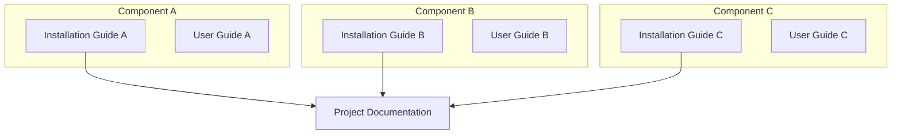
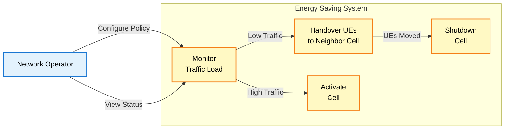
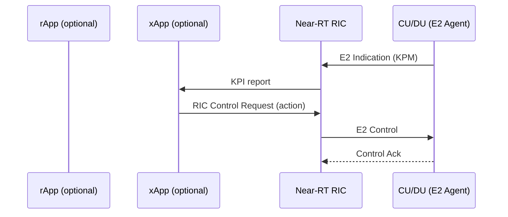
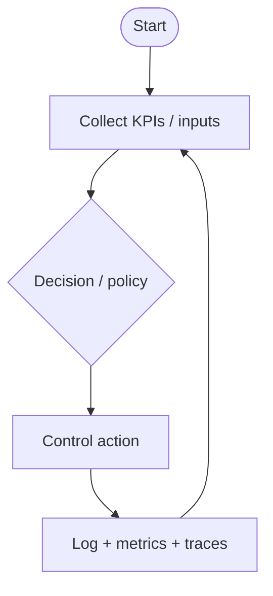
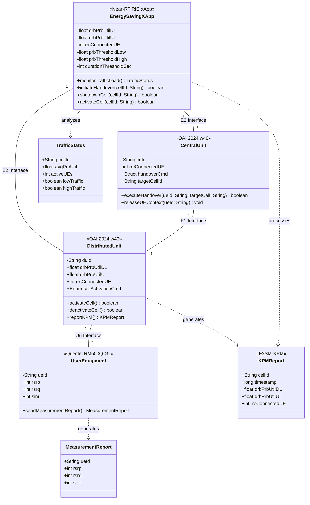

<h1 align="center">Project Documentation - Guideline</h1>

---

> [!NOTE]
> This `README.md` follows the **SOP project documentation template** and should be kept in sync:
> https://github.com/bmw-ece-ntust/SOP/blob/master/project-documentation.md

> [!CAUTION]
> **Confidentiality Notice:**
> Keep this document **private** by default. Publish only after paper acceptance.
> Request repository access from the GitHub admin.

---

> [!NOTE]
> **Documentation Structure:**
>
> - **Installation Guide**: System setup, configuration, and deployment procedures
> - **User Guide**: Operating instructions for the deployed system
> - **Project Documentation**: Technical architecture, use cases, MSC, flowcharts, and class diagrams with links to installation guides

**Documentation Hierarchy:**



## Table of Contents

> [!TIP]
> **Auto-Generate Table of Contents:**
> Use [Markdown All in One](https://marketplace.visualstudio.com/items?itemName=yzhang.markdown-all-in-one#table-of-contents) extension in VS Code for automatic TOC generation.

- [Table of Contents](#table-of-contents)
- [Introduction](#introduction)
- [Execution Status](#execution-status)
- [Minimum Requirements](#minimum-requirements)
- [System Architecture](#system-architecture)
  - [Software Requirements and Versions](#software-requirements-and-versions)
  - [Components Explanation](#components-explanation)
    - [SMO Layer - O-RAN SC \[L Release\]](#smo-layer---o-ran-sc-l-release)
    - [Near-RT RIC - FlexRIC \[v1.0.0\]](#near-rt-ric---flexric-v100)
    - [Central Unit - OAI \[2024.w40\]](#central-unit---oai-2024w40)
    - [Distributed Unit - OAI \[2024.w40\]](#distributed-unit---oai-2024w40)
    - [Radio Unit - USRP B210](#radio-unit---usrp-b210)
    - [User Equipment](#user-equipment)
- [Use Case Diagram](#use-case-diagram)
- [Message Sequence Chart (MSC)](#message-sequence-chart-msc)
  - [UC2: Handover UEs to Neighbor Cell](#uc2-handover-ues-to-neighbor-cell)
  - [UC3: Shutdown Cell](#uc3-shutdown-cell)
  - [UC4: Activate Cell](#uc4-activate-cell)
- [Flowchart](#flowchart)
  - [UC1: Monitor Traffic Load](#uc1-monitor-traffic-load)
  - [UC2: Handover UEs to Neighbor Cell](#uc2-handover-ues-to-neighbor-cell-1)
  - [UC3: Shutdown Cell](#uc3-shutdown-cell-1)
  - [UC4: Activate Cell](#uc4-activate-cell-1)
- [Class Diagram](#class-diagram)
- [System Parameters](#system-parameters)
- [References](#references)
- [Additional Links](#additional-links)
- [Contact](#contact)

## Introduction

> [!NOTE]
> **Guideline:** Define the research background, problem statement, contributions, and challenges. Structure the introduction to be suitable for academic paper publication.
>
> **Required Content:**
>
> 1. **Background**: Describe the problem domain and current state-of-the-art
> 2. **Importance**: Explain why solving this problem matters (technical and practical impact)
> 3. **Contribution**: Present your proposed solution and key innovations
> 4. **Challenges**: Identify implementation challenges and how you address them
>
> **Citation Management:**
>
> - Maintain all references in a `.bib` file for bibliography management
> - Use [Pandoc](https://pandoc.org/) to cite references from the `.bib` file in Markdown
> - The `.bib` file can be directly reused for paper writing in LaTeX

**Write-up (replace this section):**

1. **Background**:
    - What problem in O-RAN / RIC / AI-RAN are you solving?
    - What is the baseline (papers / existing xApps/rApps / O-RAN SC components)?

2. **Importance**:
    - Why it matters (impact on KPIs, operations, energy, QoE, automation)?

3. **Contribution**:
    - What do you implement (rApp and/or xApp, E2SM type, A1 policy type, O1/VES usage)?
    - What is new vs baseline?

4. **Challenges**:
    - Integration (E2/A1/O1), dataset availability, reproducibility, testbed limitations

## Execution Status

**Guideline:** Track implementation progress with a status table showing all major development and integration steps. Use status icons (✅ ⏳ ❌) to indicate progress. Include specific dates, outcomes, and error descriptions where applicable.

**Example:**

> [!NOTE]
> **Status Icons:**
> - ✅ Completed successfully
> - ⏳ In progress / Pending
> - ❌ Error / Failed (with explanation)

| Step                                  | Status | Timeline   | Execution Status / Notes |
| ------------------------------------- | ------ | ---------- | ------------------------ |
| Define research scope + baseline      | ⏳     | YYYY-MM-DD |                          |
| Define dataset / testbed plan         | ⏳     | YYYY-MM-DD |                          |
| Implement rApp (optional)             |        | YYYY-MM-DD |                          |
| Implement xApp (optional)             |        | YYYY-MM-DD |                          |
| Containerize (Docker)                 | ✅     | 2026-02-03 | See docs/continerized.md |
| Deploy (Helm)                         | ✅     | 2026-02-03 | See docs/continerized.md |
| Experiments + evaluation              |        | YYYY-MM-DD |                          |
| Paper writing (figures/tables)        |        | YYYY-MM-DD |                          |

## Minimum Requirements

> [!NOTE]
> **Guideline:** Specify the minimum hardware and software requirements needed to deploy and run the project. Include CPU, GPU, memory, storage, and network requirements.
>
> **Required Content:**
>
> 1. **Hardware Requirements**: CPU, GPU, RAM, storage, network adapters
> 2. **Software Requirements**: OS, kernel version, runtime dependencies, tools
> 3. **Component-Specific Requirements**: List requirements for each major component (SMO, RIC, DU, RU, etc.)
> 4. **Version Specifications**: Include exact versions for reproducibility

**Example:**

| Component       | Requirement                  |
|-----------------|------------------------------|
| CPU             | 2 GHz dual-core processor    |
| GPU             | NVIDIA GTX 1060 or equivalent|
| Memory (RAM)    | 4 GB RAM                     |
| Storage         | 20 GB available disk space   |
| Network         | 100 Mbps Ethernet connection |

## System Architecture

> [!NOTE]
> **Draw.io Files Management:**
>
> If you create system architecture diagrams using draw.io:
>
> - Store the raw `.drawio` files in the `./docs/drawio` folder of the GitHub repository
> - Export diagrams as PNG/SVG and embed them in the documentation
> - Keep `draw.io` files versioned for easy updates and maintenance
> - Use consistent naming: `<project-name>.drawio`

---
> [!NOTE]
> **Guideline:** Draw the end-to-end system architecture using Mermaid diagrams. For each component, provide:
>
> - A **brief component name** with version
> - A **paragraph explanation** of its functionality
> - **Hyperlinks** to corresponding installation guides (use placeholder links)
>
> This format enables easy adaptation into academic paper publications.

**Example:**

```mermaid
graph TB
    subgraph SMO["SMO / Non-RT RIC"]
        rApp["rApp (optional)\n(long-term control)"]
        O1["O1 / VES (optional)"]
    end

    subgraph NearRT["Near-RT RIC"]
        xApp["xApp (optional)\n(real-time control)"]
        E2Term["E2 Termination"]
    end

    RAN["RAN (CU/DU) + E2 Agent"]

    SMO -->|A1 (policy)| NearRT
    NearRT -->|E2 (KPM/RC)| RAN
    SMO -->|O1 (config/telemetry)| RAN
```

### Software Requirements and Versions

| Component        | Implementation | Version/Release | Purpose |
| --------------- | -------------- | --------------- | ------- |
| SMO / Non-RT RIC | O-RAN SC        | <fill>          | Service management + long-term control |
| Near-RT RIC      | O-RAN SC / FlexRIC | <fill>        | Real-time control plane for xApps |
| RAN (CU/DU)      | OAI / vendor    | <fill>          | RAN nodes providing KPIs + control hooks |
| This repo        | Python/C++/etc.  | <fill>          | Your rApp/xApp logic |
| Docker           | Docker Engine    | <fill>          | Reproducible runtime |
| Kubernetes       | K8s              | <fill>          | Deployment platform |

> [!NOTE]
> **O-RAN Version Naming Convention:**
>
> - **O-RAN Alliance Releases**: Named alphabetically (A, B, C, D, E, F, G, H, I, J, K, L, M...)
> - **O-RAN SC (Software Community)**: Follows Alliance releases with specific dates (e.g., L Release = 2024.06)
> - **OAI Releases**: Version numbers (v1.x, v2.x) with weekly tags (e.g., 2024.w40 = week 40 of 2024)
> - **Current Latest**: L Release (June 2024), M Release expected in December 2024

### Components Explanation

#### [SMO Layer - O-RAN SC [L Release]](installation-guide-link)

<Replace this section with your project’s actual SMO/Non-RT RIC components. Keep it short and link to your install guides.>

- **[SMO Platform](smo-installation-link)**: <What platform? what it hosts?>
- **[Non-RT RIC / rApp](rapp-installation-link)**: <What policy/ML/optimization runs here?>
- **[O1 (VES/NETCONF)](o1-installation-link)**: <What telemetry/config flows?>
- **[Observability](observability-installation-link)**: <Grafana/Prometheus/ELK/etc.>

#### [Near-RT RIC - FlexRIC [v1.0.0]](flexric-installation-link)

<Add component explanation>

#### [Central Unit - OAI [2024.w40]](oai-cu-installation-link)

<Add component explanation>

#### [Distributed Unit - OAI [2024.w40]](oai-du-installation-link)

<Add component explanation>

#### [Radio Unit - USRP B210](usrp-installation-link)

<Add component explanation>

#### [User Equipment](ue-installation-link)

<Add component explanation>

## Use Case Diagram

> [!NOTE]
> **Guideline:** Define the system features and use cases that fulfill project requirements. Use Mermaid diagrams to illustrate actors, use cases, and their relationships. Each use case will be detailed in the MSC section.
>
> **Required Content:**
>
> 1. **Use Case Diagram**: Mermaid diagram showing actors and their interactions with the system
> 2. **Actor Definitions**: Identify all external entities (users, systems, components)
> 3. **Use Case Definitions**: List all functional capabilities with clear names
> 4. **Relationships**: Show interactions between actors and use cases

**Example:**



## Message Sequence Chart (MSC)

> [!NOTE]
> **Guideline:** Illustrate component interactions for each use case using sequence diagrams. Focus on message flow across system interfaces (O1, A1, E2, F1 for O-RAN). MSC shows **component communication**, while flowcharts show **algorithm logic**.
>
> **Required Content:**
>
> 1. **Sequence Diagrams**: Mermaid diagrams showing message exchanges between components
> 2. **Interface Labels**: Include interface names (O1, A1, E2, F1, eCPRI, Uu)
> 3. **Message Content**: Document message parameters and data structures
> 4. **Timing**: Show order of operations and dependencies
> 5. **Error Scenarios**: Include alternative flows and error handling where relevant

**Example:**

### UC2: Handover UEs to Neighbor Cell

Describe the message flow for your use case across O-RAN interfaces (E2/A1/O1/F1).



### UC3: Shutdown Cell

<Add MSC for UC3 (replace)>

### UC4: Activate Cell

<Add MSC for UC4 (replace)>

## Flowchart

> [!NOTE]
> **Guideline:** Define the logic and decision-making algorithms for each use case. Flowcharts illustrate **algorithm logic** (conditional branches, loops, decision criteria), while MSC shows **component interactions**.
>
> **Required Content:**
>
> 1. **Decision Points**: Show conditional branches using diamond shapes
> 2. **Logic Flow**: Include if/else logic and loops with clear conditions
> 3. **Threshold Values**: Document criteria and parameters for decisions
> 4. **Error Handling**: Show alternative paths for failure scenarios
> 5. **Clear Styling**: Use consistent colors and ensure text readability

**Example:**

### UC1: Monitor Traffic Load



### UC2: Handover UEs to Neighbor Cell

<Add flowchart for UC2 (optional)>

### UC3: Shutdown Cell

<Add flowchart for UC3 (optional)>

### UC4: Activate Cell

<Add flowchart for UC4 (optional)>

## Class Diagram

> [!NOTE]
> **Guideline:** Define the software architecture using Object-Oriented Programming (OOP) principles. Include classes, attributes (following 3GPP standards), methods, and relationships (inheritance, composition, aggregation).
> Include the parameters defined on the [System Parameters](#system-parameters) table.
>
> **Required Content:**
>
> 1. **Classes**: Define main classes following OOP design patterns
> 2. **Attributes**: Use 3GPP parameter names (e.g., `DRB.PrbUtilDL`, `RRC.ConnectedUE`)
> 3. **Methods**: Define functions that execute MSC call-flows
> 4. **Relationships**: Show inheritance (is-a), composition (has-a), aggregation, dependencies
> 5. **Access Modifiers**: Use `-` for private, `+` for public, `#` for protected
> 6. **Data Types**: Specify types (String, Integer, Float, List, etc.)
>
> **OOP Principles:**
>
> - **Encapsulation**: Group related data and methods in classes
> - **Abstraction**: Use interfaces or abstract classes where applicable
> - **Inheritance**: Show class hierarchies (e.g., `BaseXApp` → `EnergySavingXApp`)
> - **Polymorphism**: Define overridable methods

## System Parameters

> [!NOTE]
> **Guideline:** Define the input and output parameters used in the system, following 3GPP specifications. These parameters should be reflected in the class diagram attributes.
>
> **Required Content:**
>
> 1. **Input Parameters**: System inputs (e.g., KPIs from E2 interface, A1 policies)
> 2. **Output Parameters**: System outputs (e.g., control decisions, cell status)
> 3. **3GPP Standards**: Reference TS specifications for each parameter with hyperlinks
> 4. **Parameter Table**: Include columns for Category, Parameter, Type, 3GPP Spec, Unit, Description, Range, Source/Destination

**Example:**

| Category               | Parameter              | Type    | Unit       | Spec / Ref | Description |
| ---------------------- | ---------------------- | ------- | ---------- | ---------- | ----------- |
| **E2 KPM Inputs**      | `DRB.PrbUtilDL`        | Float   | %          | TS 28.552 | Downlink PRB utilization |
| **E2 RC Outputs**      | `controlAction`        | Struct  | -          | E2SM RC    | Control action payload |
| **A1 Policy Inputs**   | `policyThreshold`      | Float   | %          | A1AP       | Policy threshold |

**Example:**



## References

> [!NOTE]
> **Guideline:** Use IEEE citation style for all references. Cite references in the text using numerical format [1], [2], etc., and list them in order of appearance at the end of the document.
>
> **Citation Format:**
>
> - In-text citations: Use square brackets with numbers [1], [2], [3]
> - Multiple citations: [1], [2] or [1]–[3] for ranges
> - References list: Number sequentially in order of first appearance
>
> **For Pandoc Conversion:**
>
> - Create a `references.bib` file with BibTeX entries
> - Use Pandoc with IEEE CSL: `pandoc document.md --bibliography=references.bib --citeproc --csl=ieee.csl -o output.pdf`
> - Download `ieee.csl` from: https://github.com/citation-style-language/styles/blob/master/ieee.csl

**Example References (IEEE Format):**

[1] 3GPP, "Management and orchestration; 5G performance measurements," 3rd Generation Partnership Project (3GPP), Technical Specification TS 28.552 V18.5.0, 2024. [Online]. Available: https://www.3gpp.org/ftp/Specs/archive/28_series/28.552/

[2] 3GPP, "NR; NR and NG-RAN Overall description; Stage-2," 3rd Generation Partnership Project (3GPP), Technical Specification TS 38.300 V18.0.0, 2024. [Online]. Available: https://www.3gpp.org/ftp/Specs/archive/38_series/38.300/

[3] 3GPP, "NR; Radio Resource Control (RRC) protocol specification," 3rd Generation Partnership Project (3GPP), Technical Specification TS 38.331 V18.4.0, 2024. [Online]. Available: https://www.3gpp.org/ftp/Specs/archive/38_series/38.331/

[4] 3GPP, "Management and orchestration; Generic management services," 3rd Generation Partnership Project (3GPP), Technical Specification TS 28.532 V18.5.0, 2024. [Online]. Available: https://www.3gpp.org/ftp/Specs/archive/28_series/28.532/

[5] O-RAN Alliance, "O-RAN.WG2.A1AP-v06.00: O-RAN A1 interface: Application Protocol," O-RAN Alliance, Technical Specification, 2024. [Online]. Available: https://specifications.o-ran.org/

[6] O-RAN Alliance, "O-RAN.WG3.E2AP-v03.01: O-RAN E2 Application Protocol," O-RAN Alliance, Technical Specification, 2024. [Online]. Available: https://specifications.o-ran.org/

[7] O-RAN Software Community, "O-RAN Software Community L Release," 2024. [Online]. Available: https://wiki.o-ran-sc.org/display/ORAN/L+Release. [Accessed: Oct. 24, 2024].

[8] EURECOM, "OpenAirInterface 5G RAN Implementation," Version 2024.w40, 2024. [Online]. Available: https://gitlab.eurecom.fr/oai/openairinterface5g

---

## Additional Links

- SOP template (source of truth): https://github.com/bmw-ece-ntust/SOP/blob/master/project-documentation.md
- Sync script (downloads SOP into this repo): scripts/sync_sop_project_documentation.sh
- Containerization + Helm tutorial: docs/continerized.md
- Helm chart template: helm/template-app
- User guide (project-specific): docs/USER-GUIDE.md

---

## Contact

- **Maintainer:** Your Name (<your.email@example.com>)
- **Support Team:** <support@your-project.com>
- **Emergency Contact:** +1-xxx-xxx-xxxx (for critical issues only)
